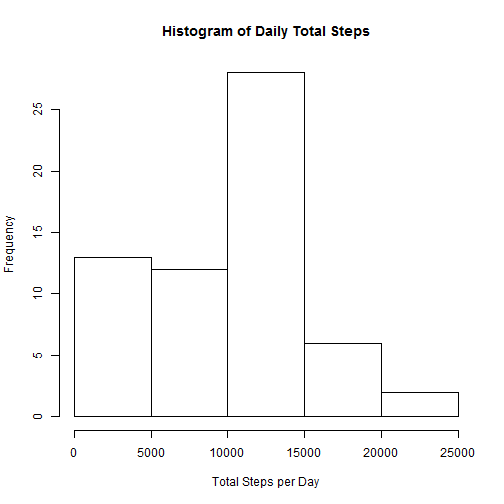
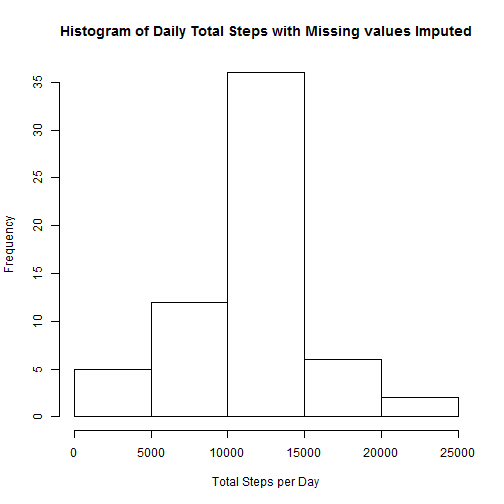

## Loading and preprocessing the data

First un-zip the data and read the .csv file. Changing the date column format to date for analysis. 
Saving the data to data.table format. 


```r
#setwd("C:/Users/ruit/Documents/Courses/Reproducible Research/RepData_PeerAssessment1")
unzip("activity.zip") 
activity <- read.csv("activity.csv", stringsAsFactors = F)
#library("Lubridate")
activity$date <- as.Date(activity$date)
library("data.table")
act <- data.table(activity)
```


## What is mean total number of steps taken per day?

Summing the steps taken for each day. Plotting a histogram of daily total steps. 


```r
steps.by.day <- act[,sum(steps, na.rm = T), by = date] 
hist(steps.by.day$V1, xlab = "Total Steps per Day", main = "Histogram of Daily Total Steps")
```

 


Note that how one handle the missing values could impact the mean and median number of steps per day. At some point the missing values will have to be removed and depending on whether it is done while summing step for each day or while averageing the daily value, will yield different results. Here we opted for removing when calculating the daily total. 


```r
me <- format(round(mean(steps.by.day$V1), 0))

med <- format(round(median(steps.by.day$V1),0))
```

This produces a mean of 9354 and median of 10395 total daily steps. 

## What is the average daily activity pattern?

When averageing the steps per interval we need to remove the missing values otherwise all all interval means will produce NAs.  Calcualting the average per interval and plotting a time series shows how activities changes with the interval in the day. 


```r
steps.by.interval <- act[, mean(steps, na.rm = T), by = interval]

plot(steps.by.interval, type = "l", ylab = "Mean number of Steps")
```

 

The highest activity level of the day is where the interval mean is highest.  


```r
max.interval <- steps.by.interval[steps.by.interval$V1 == steps.by.interval[,max(V1)],]

max.mean <- format(round(max.interval[1,V1],0))

interval <- max.interval[1,interval]
```
The max mean steps are 206 taking place in interval 835


## Imputing missing values

Total number of missing values:

```r
sum(is.na(act$steps))
```

```
## [1] 2304
```

For the misssing values, we chose to insert the mean value for the given interval as there seems to be a strong pattern in the activity.  


```r
setkey(act, interval); setkey(steps.by.interval, interval)
act2 <- merge(act, steps.by.interval)

act2[, steps2:= ifelse(is.na(steps), V1, steps) ]
```

```
##        interval steps       date       V1    steps2
##     1:        0    NA 2012-10-01 1.716981  1.716981
##     2:        0     0 2012-10-02 1.716981  0.000000
##     3:        0     0 2012-10-03 1.716981  0.000000
##     4:        0    47 2012-10-04 1.716981 47.000000
##     5:        0     0 2012-10-05 1.716981  0.000000
##    ---                                             
## 17564:     2355     0 2012-11-26 1.075472  0.000000
## 17565:     2355     0 2012-11-27 1.075472  0.000000
## 17566:     2355     0 2012-11-28 1.075472  0.000000
## 17567:     2355     0 2012-11-29 1.075472  0.000000
## 17568:     2355    NA 2012-11-30 1.075472  1.075472
```

```r
act.imputed <- act2[,.(steps2, date, interval)]

suppressWarnings(names(act.imputed) <- names(act))
```

Now with a new data set where the missing values have been imputed.  Let's see how this impacts the total steps per day histogram. 


```r
steps.by.day2 <- act.imputed[,sum(steps, na.rm = T), by = date] 
hist(steps.by.day2$V1, xlab = "Total Steps per Day", main = "Histogram of Daily Total Steps with Missing values Imputed")
```

 


This also gives us new values for mean and median.


```r
me2 <- format(round(mean(steps.by.day2$V1), 0))

med2 <- format(round(median(steps.by.day2$V1),0))
```

This produces a mean of 10766 and median of 10766 total daily steps. 


## Are there differences in activity patterns between weekdays and weekends?

Here we are exploring the difference in activity pattern from weekday to weekend. 


```r
suppressWarnings(act.imputed[, daytype:= ifelse(weekdays(act.imputed$date) %in% c("Saturday","Sunday"), "Weekend", "Weekday") ])
```

```
##            steps       date interval daytype
##     1:  1.716981 2012-10-01        0 Weekday
##     2:  0.000000 2012-10-02        0 Weekday
##     3:  0.000000 2012-10-03        0 Weekday
##     4: 47.000000 2012-10-04        0 Weekday
##     5:  0.000000 2012-10-05        0 Weekday
##    ---                                      
## 17564:  0.000000 2012-11-26     2355 Weekday
## 17565:  0.000000 2012-11-27     2355 Weekday
## 17566:  0.000000 2012-11-28     2355 Weekday
## 17567:  0.000000 2012-11-29     2355 Weekday
## 17568:  1.075472 2012-11-30     2355 Weekday
```

```r
steps.by.interval2 <- act.imputed[, mean(steps, na.rm = T), by = list(interval, daytype)]


library(lattice)
steps.by.interval2 <- transform(steps.by.interval2, daytype = factor(daytype))
xyplot(V1 ~ interval | daytype, data = steps.by.interval2, type = "l" ,layout = c(1, 2), ylab = "Number of Steps")
```

 

